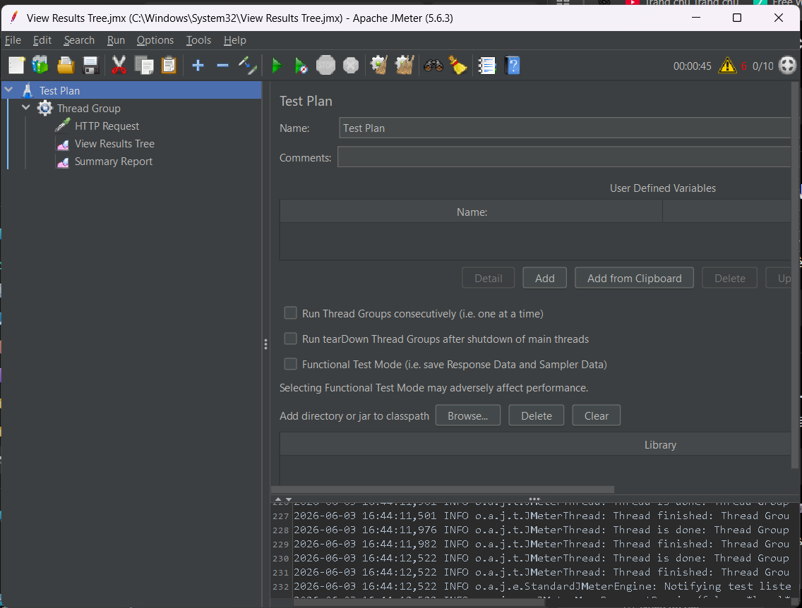
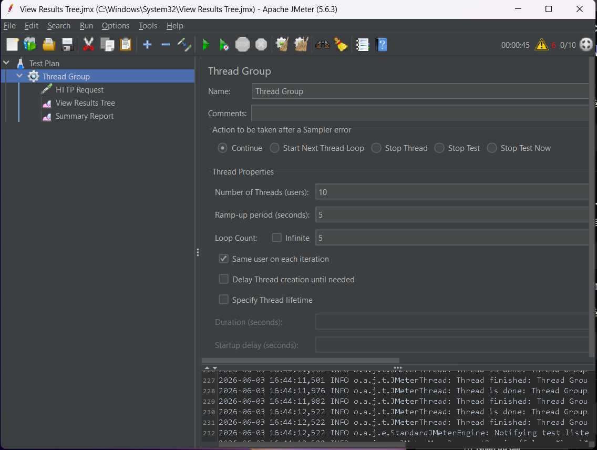
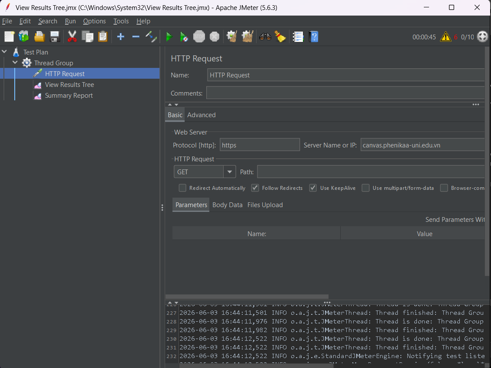
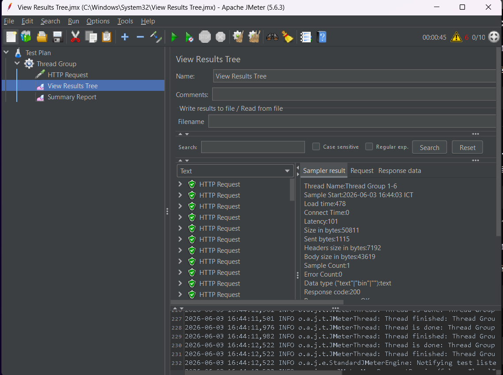
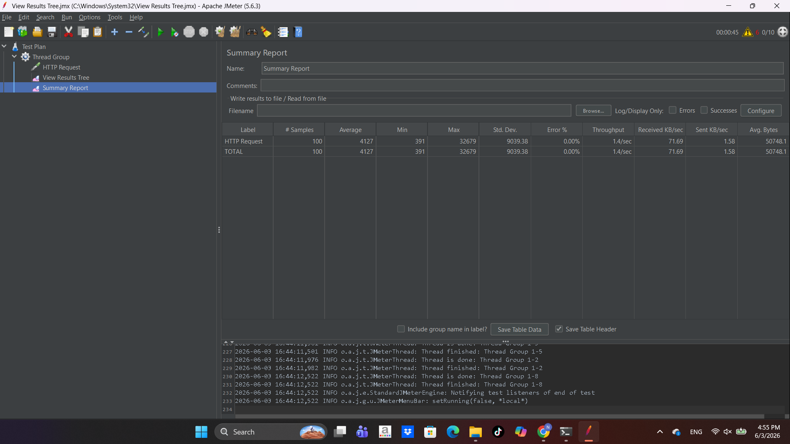

# Apache JMeter Website Testing

## Introduction

This project demonstrates website performance testing using Apache JMeter.

---

# Tools Used

- Apache JMeter
- Java JDK
- Visual Studio Code
- GitHub

---

# Test Configuration

| Parameter         | Value     |
| ----------------- | --------- |
| Number of Threads | 10        |
| Ramp-Up Period    | 5 seconds |
| Loop Count        | 5         |
| HTTP Method       | GET       |

---

# Tested Website

```text id="mec4zz"
https://example.com
```

---

# Screenshots

## JMeter Home



---

## Thread Group



---

## HTTP Request



---

## View Results Tree



---

## Summary Report



---

# Project Structure

```text id="rm5s71"
jmeter-testing-project/
│
├── README.md
├── screenshots/
│   ├── jmeter-home.png
│   ├── thread-group.png
│   ├── http-request.png
│   ├── view-results-tree.png
│   └── summary-report.png
│
└── testplan/
    └── website-test.jmx
```

---

# Conclusion

The website handled multiple simulated requests successfully with stable performance and no major errors.
